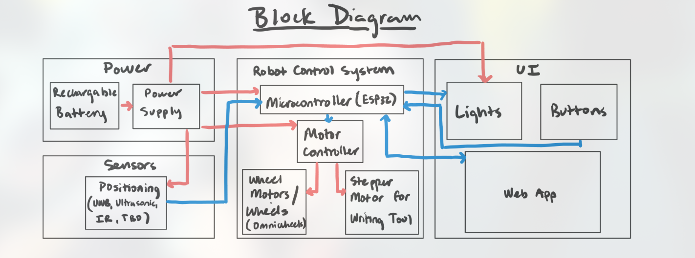

# Notebook Entry Lab Week of 9/16/2024

## Objectives
- First TA meeting with dongming 
- Went over our project proposal, what to include in design review1

## Progress
- Discussed initial project ideas and received feedback on scope and feasibility.

- Noted requirements for the design review presentation, including subsystem specifications and tolerance analysis.

We also started on figuring out final design templates so that next week we can talk it over with Gregg

This was the block diagram we used (courtesy of my partner mjpaul3) for discussion this week:

### TA meeting 9/17

During the TA meeting, the following feedback and action items were discussed for the design document:

1. **Design Document Feedback:**
   - Clearly labeled the **problem** and **solution** sections for better clarity.
   - Added **visual aids** and ensured the overall design was presented at a **high level**.
   - Updated the **block diagram**:
     - Labeled all lines properly to indicate signal flow.
     - Used appropriate software tools to create a clean and professional diagram.
   - Provided a **subsystem overview**, detailing each component's role.
   - Outlined **subsystem requirements** to meet functional and performance goals.

2. **Tolerance Analysis:**
   - Included **proof of design tolerances**:
     - Calculated motor torque requirements to handle the expected load.
     - Verified the battery's capacity to ensure sufficient power for the system.
     - Conducted directional calculations to ensure the robot's motion is within the desired limits.

3. **Ethics and Safety:**
   - Documented potential safety concerns and proposed mitigation strategies.
   - Compiled a reference page with citations for all sources used in the design.

4. **Examples for Reference:**
   - Used **SP 2024 Team 19's TA Feedback** and **FA 2023 Team 3's Design Document** as examples of strong documentation.

#### **Next Steps**
- Finalize updates to the block diagram and integrate them into the design document.
- Conduct additional testing to validate motor torque and battery capacity calculations.
- Prepare the design document for the next TA review session.