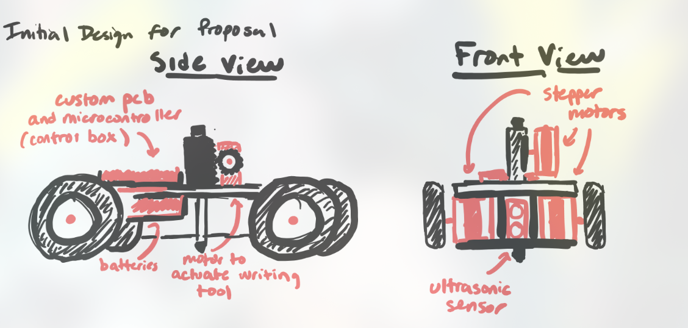
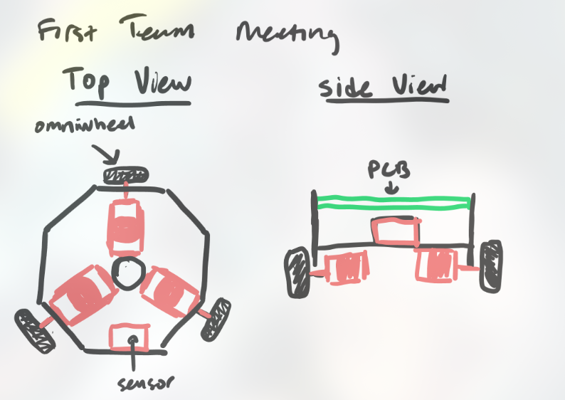
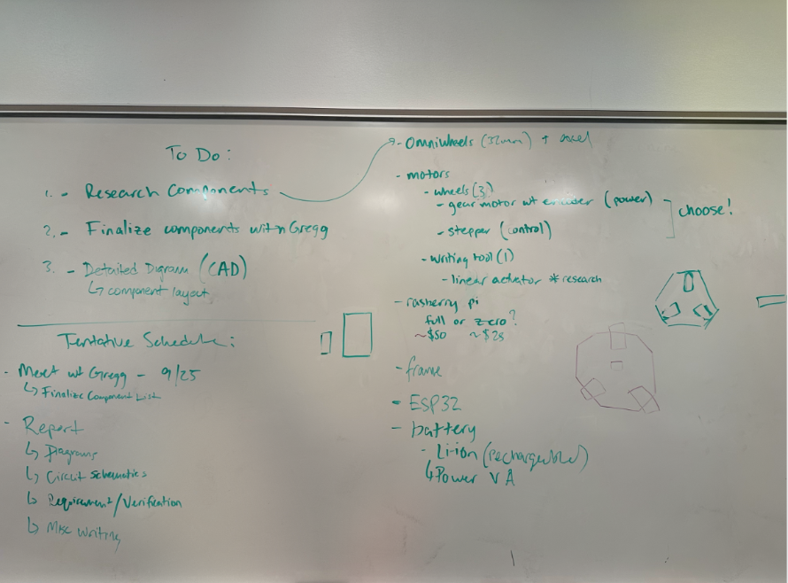

# Notebook Entry Lab 9/23/2024

## Objectives
- Visit the machine shop for initial design discussions with Gregg.
- Determine motor requirements for the project.

## Progress
On 9/12, my partner Matt Paul (mjpaul3) decided to implement a basic 4-wheel design remniscient of the main chassis we used in ECE110

On 9/16, we decided to implement this final design, which was considerably shorter compared to the initial design we found 4 days earlier, which would be considerably less expensive compared to the first design (less wheels and motors), and also lends itself to more slick motion thanks to the omniwheels.`

On 9/24, we decided to brainstorm what we wanted to make for the design doc:

