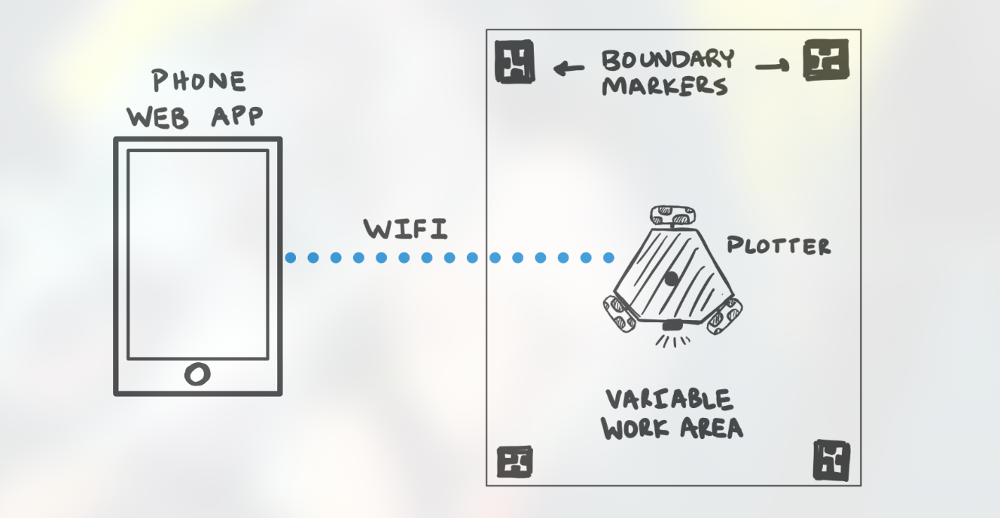
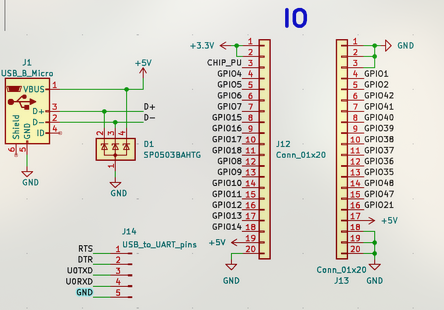

# Notebook Entry Lab 9/30/2024

## Objectives
- Finalize Design Document
- Finalize subsystem requirements and start ordering parts.

## Progress
- Defined the high-level system architecture, including motor control, sensor integration, and Wi-Fi communication.
- Ordered the ESP32, motor drivers, and gear motors for testing.
- Created initial CAD models for mechanical design to ensure component fit.

This was the main design we used for understanding the web app communications:

### TA meeting 10/1
- Main deadline is to sign up for peer review by tomorrow (10/2)
- Requirements/Values not specified sufficiently yet, so we needed to fix that
- Our current schematic model wasn't enough, so we needed to specify more; for instance, our IO interface wasn't properly addressed and we didn't attach the correct footprint yet:

Main todo: create slideshow for design review

### 10/3: Schedule fixing
- All we did here was fix out our schedule that we will use; this was mainly to brainstorm our workflow
    - We added details to design doc
    - Understand software testing/debugging workflow; here I decided that we will use PID