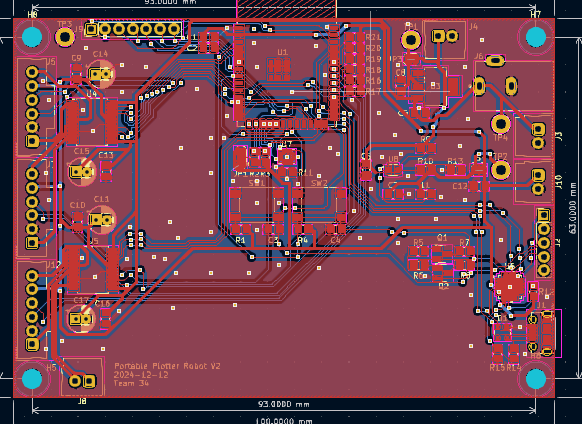

# Notebook Entry Lab 11/04/24

## Objectives
- Address feedback on PCB design.
- Make necessary changes to improve the PCB layout and functionality.

## Progress
The following changes were made to the PCB design based on feedback received:

1. Moved the **ESP32** to the edge of the board to facilitate easier connections.
2. Corrected the footprint for the **6-5V power supply** and **UART bridge**.
3. Added **power connections for the Raspberry Pi**.
4. Included **test points** on the PCB for debugging and monitoring.
5. Added **encoder connections** for the motors to support precise feedback.
6. Ordered additional **buttons** for control purposes.
7. Exported pins for the **ESP32** and **UART** for extended connectivity.
8. Added **Raspberry Pi GPIO pins** to support interfacing.

These changes ensure that the PCB layout supports all system components effectively and meets the design requirements.

## Next Steps
- Begin testing the updated PCB with connected components.
- Verify the functionality of the newly added encoder connections and Raspberry Pi GPIO pins.
- Ensure that all exported pins are accessible and working as intended.
