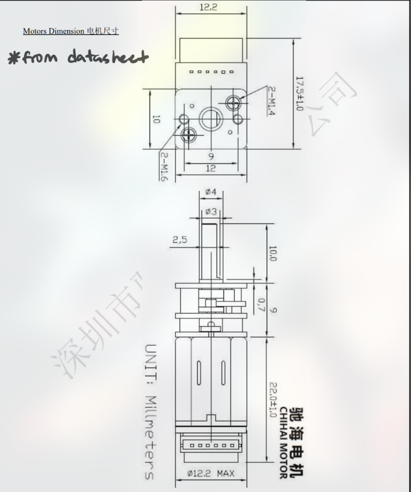
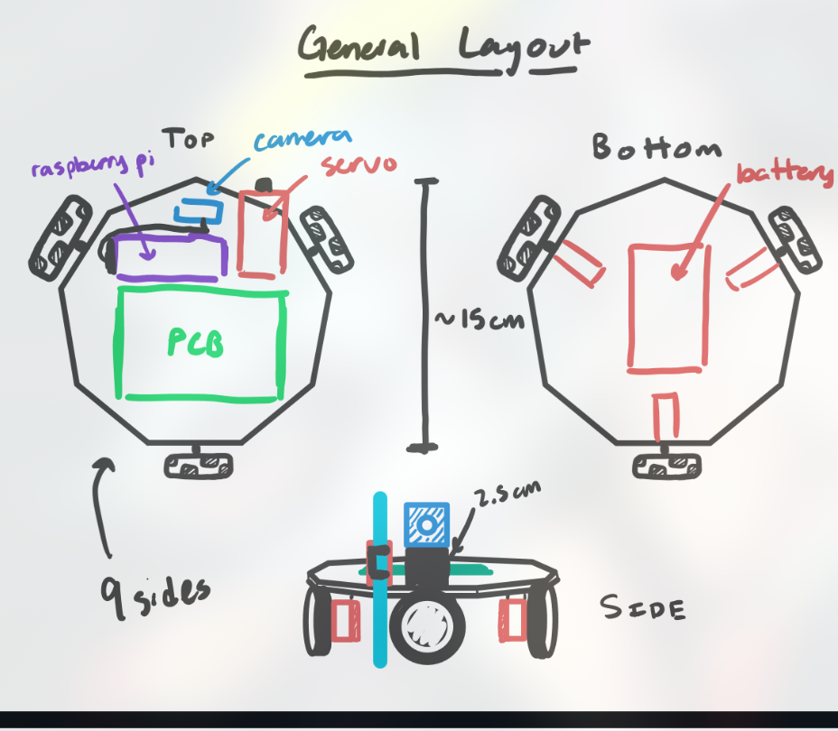

# Notebook Entry Lab 11/11/24

## Objectives
- Finalize motor identification and connections for the control system.
- Update the parts list with the required capacitors, resistors, and inductors for PCB design.
- Review and refine the general layout of the robot components, including battery, Raspberry Pi, and servo placement.

## Progress
1. **Motor Identification and Wiring**:
   - Identified motor pins and their corresponding connections:
     - OUT1, OUT2, and OUT3 mapped to motor output pins.
     - CF1 and CF2 for current feedback.
     - 3.3V and GND for power.
   - Verified the PWM signals from the controller and reviewed the output waveform for consistency with the desired motor behavior.

2. **Updated Parts List**:
   - Capacitors (C): $10 \, \mu F$, $1 \, \mu F$, $4.7 \, \mu F$, $21 \, \mu F$.
   - Resistors (R): $1 \, k\Omega$, $22.1 \, k\Omega$, $47.5 \, k\Omega$, $494 \, k\Omega$, $100 \, k\Omega$, $10 \, k\Omega$, $3.3 \, k\Omega$.
   - Inductors (L): $1 \, \mu H$.
   - Verified counts and confirmed all necessary components are available for assembly.

3. **Component Layout**:
   - Completed a detailed layout of the robot:
     - General layout includes the top and bottom placements.
     - Raspberry Pi mounted at the top alongside the servo for camera movement.
     - PCB and battery located at the bottom for weight distribution.
     - Ensured all components are securely mounted with proper clearance for screws and accessibility.

(diagrams courtesy of partner mjpaul3)

4. **Design Dimensions**:
   - Referenced motor dimensions and wheel configurations directly from the datasheets.
   - Integrated omniwheels and servo clearances into the layout to ensure smooth operation.

5. **Battery and Power Connections**:
   - Finalized the battery placement and connections.
   - Ensured compatibility with power regulators and designed for easy accessibility during operation.

## Next Steps
- Test the motor drivers and PWM control to confirm functionality with the updated connections.
- Begin assembling the robot with the finalized layout and components.
- Simulate and verify power stability across all subsystems before moving to integrated testing.
